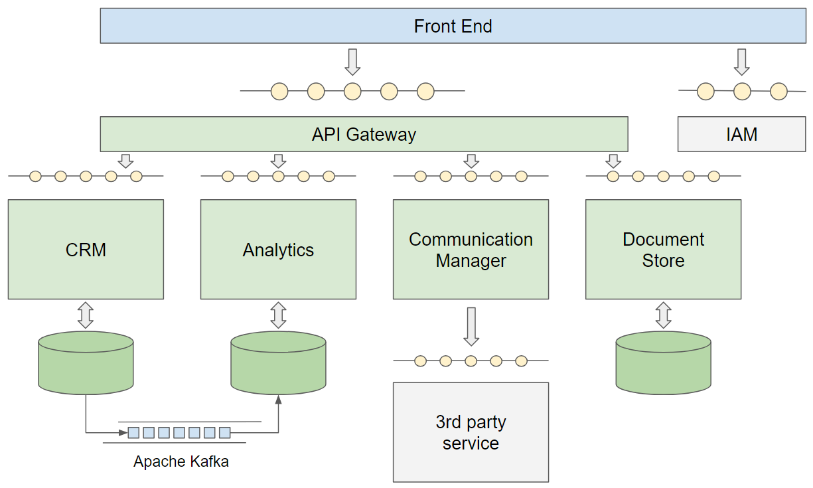

# Temporary Job Management CRM

A sophisticated CRM designed for efficient management of temporary job placements. This system enhances interactions between candidates, clients, and stakeholders in the recruitment process, helping HR professionals make data-driven decisions and ultimately improve the quality of job placements.

## Features

- **Centralized Management**: Organizes candidate profiles, job offers, and client relationships in a single platform.
- **Microservices Architecture**: Built with Docker, leveraging a distributed, microservices-based architecture for scalability and maintainability.
- **RESTful APIs**: Each microservice exposes a RESTful API, enabling seamless integration and communication across services.
- **Data Storage**: Core data is stored in PostgreSQL, with MongoDB as an analytics database for real-time insights.
- **IAM Integration**: Utilizes Keycloak and Spring Security for identity and access management, implementing OAuth2.0 Authorization Code Flow for secure authentication.
- **API Gateway**: Configured using Spring Cloud to manage API requests and simplify client-service interactions.
- **Notification System**: Integrated with Apache Camel and the Gmail API to provide email notifications for key events.
- **Real-Time Analytics**: Kafka Stream processes data from the main database to generate analytics, which are saved to MongoDB.
- **Frontend**: A single-page application (SPA) developed with React for a responsive and user-friendly experience.

## Technologies

- **Backend**: Kotlin, Spring Boot, Spring Data, Spring Security, Keycloak IAM, Spring Cloud
- **Frontend**: React
- **Databases**: PostgreSQL (primary), MongoDB (analytics)
- **Messaging & Analytics**: Apache Kafka, Kafka Stream
- **Notification System**: Apache Camel, Gmail API
- **Deployment**: Docker

## Architecture Overview

The CRM is built as a collection of loosely coupled microservices that communicate over REST APIs. These services are deployed in Docker containers for easy scalability and deployment.

### Core Services

1. **API Gateway**: Manages and routes incoming API requests, acting as the central access point for all other microservices.
2. **Analytics**: Processes data for real-time analytics using Kafka and MongoDB for storing insights.
3. **Communication Manager**: Handles email notifications and user communications through Apache Camel and Gmail API.
4. **CRM**: Manages core CRM functionalities such as candidate and job offer management.
5. **Document Store**: Stores and manages user-uploaded documents and files.

### Data Flow and Analytics

- Data changes are captured in real time using Kafka Stream, with analytics data piped into MongoDB for easy access and visualization.

### Security

- Authentication and authorization are managed through Keycloak and Spring Security, with OAuth2.0 Authorization Code Flow to secure API access.
